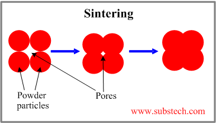

```{r setup, include=FALSE}
knitr::opts_chunk$set(echo = TRUE)
```

## Introduction

Aluminum oxide, Al<sub>2</sub>O<sub>3</sub>, commonly called "alumina", is a common component in advanced ceramics. When refined from bauxite, alumina generally looks like a white powder similar to table salt or granular sugar. Alumina ceramics are extremely resistant to wear and corrosion, and are excellent electrical insulators. As such, alumina ceramics have found applications in electronics, pump components, automotive sensors, semiconductors, and aerospace components.

"Sintering" is the processes of forming a solid mass from a compact powder without melting. The atoms of the material diffuse beyond the boundaries of the individual particles, thus fusing them together into a single solid piece. The process can be likened to ice cubes sticking together in a glass, or the compaction of snow into ice. Although heat is involved, the temperatures used in the process is generally below the melting point of the material. Commercial ceramics such as those described above are typically manufactured using a sintering process. 


<figure>

<figcaption>A simple illustration of the basic process of sintering</figcaption>
</figure>

<br>  

In 1974, Dennis H. Taylor presented his doctoral thesis from the University of Leeds entitled "Rapid Sintering of Alumina: Effects of Particle Morphology and Impurities". During manufacture of alumina ceramics, the process needs to be refined to control for things such as final density of the material, the size of the grains (the fused particles), the size and density of the pores (gaps between the fused particles), the strength of the fused material, etc. At the time of this study, there was significant disagreement on how adjustments to different parameters of the sintering process impacted the properties of the fused material. 

For his thesis, Dennis chose to study the effect of various impurities in the alumina powder on the sintering kinetics (the rate of the sintering process), the microstructure of the fused material (the size and distribution of the grains and pores), as well as the final density of the material.

This was the first work to ever study the effects of particle morphology or the isothermal kinetics of sintering at ultra high temperatures. As such, the work required the use of several pieces of what was then cutting edge technology as well as several technical innovations that had not been described before:

* In order to study the structure of the materials before and after sintering, Dennis made use of one of the world's first scanning electron microscopes, located at the University of Leeds. 

* The alumina samples used in this study complete sintering in less than 2 minutes. Therefore, Dennis had to invent and manufacture a furnace that was capable of very rapid rates of heating to temperatures in excess of 2000$^\circ$ C, and that could operate under a variety of atmospheric conditions and pressures.  

* In order to observe the rates of sintering, Dennis also invented and manufactured a new type of dilatometer (a device that measures volume change). This dilatometer used a "shrinking shadow" technique where a beam of light passes through the furnace onto the sample. A photodetector on the opposite side measures how much light is blocked by the sample, i.e. the size of its shadow. As the sample sinters, the resultant change in volume is precisely measured simply by the change in its shadow.  

* Because Dennis was measuring the sintering rates more precisely than had ever been done before, he also observed patterns in the rates that had never been seen before. In order to describe these shapes, Dennis wrote a computer program in Fortran, run on an IBM mainframe computer, to calculate the best fit of multiple mathematical equations to his sintering curves.  

This app provides a modern recreation of Dennis' analysis of the sintering kinetics, comprising chapters 7 and 8 of his thesis. Rather than using hundreds of lines of fortran code, we perform dynamic modeling of the data using a few basic lines of R code. Additionally, we allow the user to interactively explore the various parameters used in the model fitting of the data.
